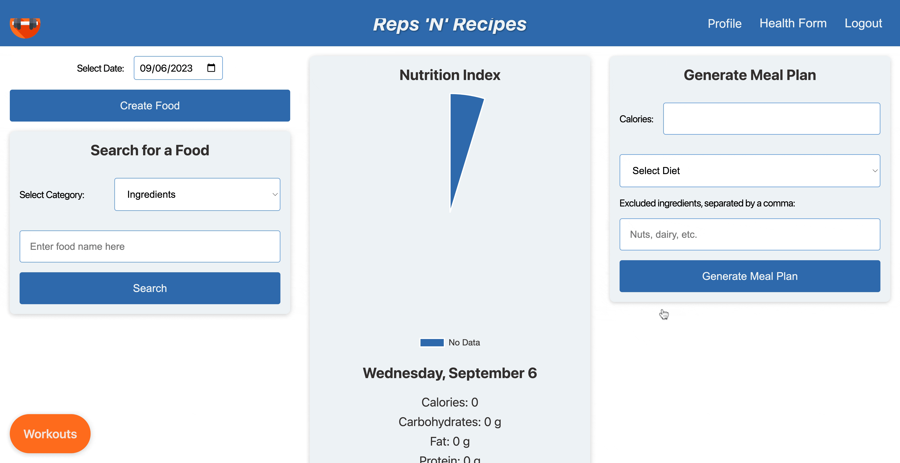
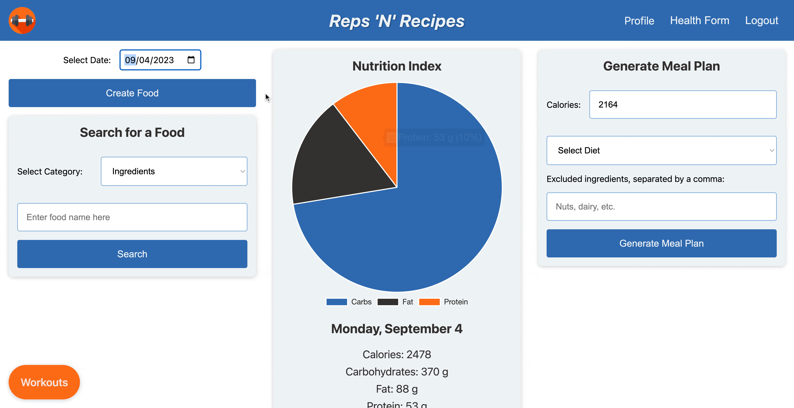
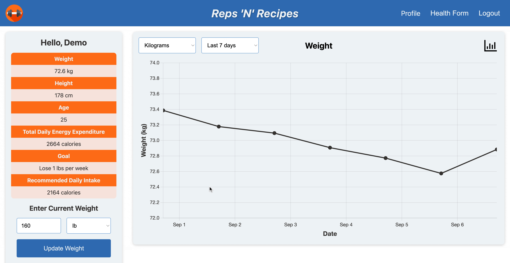

# Reps 'N Recipes

Reps 'N Recipes if a fitness app designed to help users achieve their health and wellness goals. There's a variety of fitness apps out there, but they either allow users to track their workouts or nutrition. Rather than requiring two apps, Reps 'N Recipes combines both those features into one simple app. 

The app features a database of built-in exercises with GIFs for users to see how to perform the movement, and they can input exercises manually if they are not in the database. For beginners, the app also generates workouts for the user to follow to make their fitness journey easier. 

Additionally, Reps 'N Recipes features Spoonacular API for easy meal tracking by searching for the ingredient and inputting the number of servings, as well as the ability to generate a meal plan for the day based on the user's parameters.

# [LIVE](https://reps-n-recipes-d98cf03910d0.herokuapp.com/)

## Technologies Used

- **MongoDB:** A NoSQL database that stores data in a flexible, JSON-like format. Ideal for unstructured data and easier to scale horizontally.

- **Express.js:** A web application framework for Node.js that simplifies tasks like routing, API creation, and interacting with databases.

- **React.js:** A JavaScript library for building dynamic user interfaces. It excels in creating reusable components and managing state.

- **Node.js:** A JavaScript runtime that allows you to run JavaScript on the server. It's non-blocking and event-driven, which makes it efficient for scalable applications.

- **Chart.js** A data visualization library, that can be integrated with React to create charts/graphs. Reps 'N' Recipes integrated Chart.js to visualize the user's daily nutrition, and their calories, macros, weight, and exercises over time.

- **Redux** is a state management library often used with React. It provides a centralized store for state that is needed across the entire application. Redux makes it easier to manage global state, especially in larger applications.

- **Spoonacular** is an API that provides a broad range of food and nutrition data. This API is the source of the nutrition information for the app's food database, as well as the meal planning and tracking component. We leveraged the API endpoints for ingredients,products, recipes, menu items, and meal plan generation.

- **Amazon Web Services (AWS) S3** is a storage service that allows for scalable and secure storage of files. Reps 'N' Recipes utilizes S3 to store exercise GIFs so that users can see the exercise they are adding to their workout.

## Features

### User Profile & Customization

Upon signing up, users can complete a short survey about their physical measurements and goals. This will generate estimates for their total daily energy expenditure (TDEE) and recommended daily caloric intake.



### Workout Tracking

Choose A Pre-set Workout and Go! Or, create your own workout from scratch by adding and/or removing exercises and sets. We offer a variety of exercises, complete with how-to GIFs.


Log the weight you used and the number of repetitions you completed! Then, re-visit your previous workouts to ensure you are making progress each workout.


### Nutrition Tracking

Search Spoonacular's database of ingredients, food products, recipes, and menu items. Select the one that matches what you ate that day, adjust the quantity, and record it.


Decided you want to have seconds? No problem, simply update the quantity. View your macronutrient breakdown for each day by flipping through the calendar.



If you aren't sure how to meet your calorie goals for a particular day, generate a meal plan suited to your goals in one click.


### User Profile

Update your weight daily, changing your estimated TDEE instantly, mitigating plateaus.



View your caloric and macronutrient intake over time, your weight over time, and your estimated 1-rep max of any exercise in our database, calculated from workouts you have recorded!


## Code Snippets

A selector function that pulls all of a user's workouts from the state that contain the exercise for which they want to see their progress, extracts the sets for that particular exercise only, calculates a 1-rep max (1RM) based on the weight and repetitions performed, and keeps only the highest estimated 1RM per day.

```javascript
export const getWorkoutsByExercise = exercise => state => {
    const workouts = state.users.workouts;
    const workoutsByExercise = workouts
        .filter(workout => workout.sets.find(set => set.hasOwnProperty(exercise)))
        .reduce((accumulator, workout) => {
            const exerciseSets = workout.sets.find(
                set => set.hasOwnProperty(exercise))[exercise];
        
            if (exerciseSets && exerciseSets.length > 0) {
                const topSet = exerciseSets.sort((a, b) => {
                    if (a.kg !== b.kg) {
                        return a.kg - b.kg;
                    } else {
                        return a.reps - b.reps;
                    }
                }).slice(-1)[0];

                const estimated1RM = topSet.kg / (1.0278 - (0.0278 * topSet.reps));
                accumulator[workout.datePerformed.split('T')[0]] = estimated1RM;
            }

            return accumulator;
        }, {});

    return workoutsByExercise;
}
```

A useEffect triggered upon refresh on the workout page. If a user refreshes the page during a workout (the true if condition), the effect will grab the currentWorkout and the current workout duration stored in the sessionStorage. Once the page has refreshed, the sessionStorage and the state variable exerciseList (which renders the workout details) are re-filled. Also the stop watch time before the refresh is reinstated using the resumeTime state variable.

```javascript
useEffect(()=>{
    const currentWorkout = JSON.parse(sessionStorage.getItem("currentWorkout"));
    
    if (currentWorkout){
        sessionStorage.setItem("currentWorkout", JSON.stringify(currentWorkout));
        const workoutMeta = JSON.parse(sessionStorage.getItem("currentWorkoutMETA"));
        setWorkoutStarted(workoutMeta.active)
        setResumeTime(parseInt(workoutMeta.time,10))
        setExerciseList([...currentWorkout.sets])
    } else {
        resetWorkout()
    }
}, [])
```

Resuming the stopwatch in Timer functional component:

```javascript
const Timer = ({isActive, setIsActive, resumeTime, setResumeTime}) => {
    const [time, setTime] = useState(resumeTime || 0);
    useEffect(() => {
        if (resumeTime !== null) {
            setTime(resumeTime);
            setResumeTime(null);
            setIsActive(true);
        }
    }, [resumeTime]);
}
```

## Group Members

- [Stefan Lazarevic](https://www.linkedin.com/in/stefan-lazarevic-a5b60413a/)
- [Elliot Chang](https://www.linkedin.com/in/elliotchang126/)
- [Nico Carlier](https://www.linkedin.com/in/nicholas-carlier-ba8473193/)